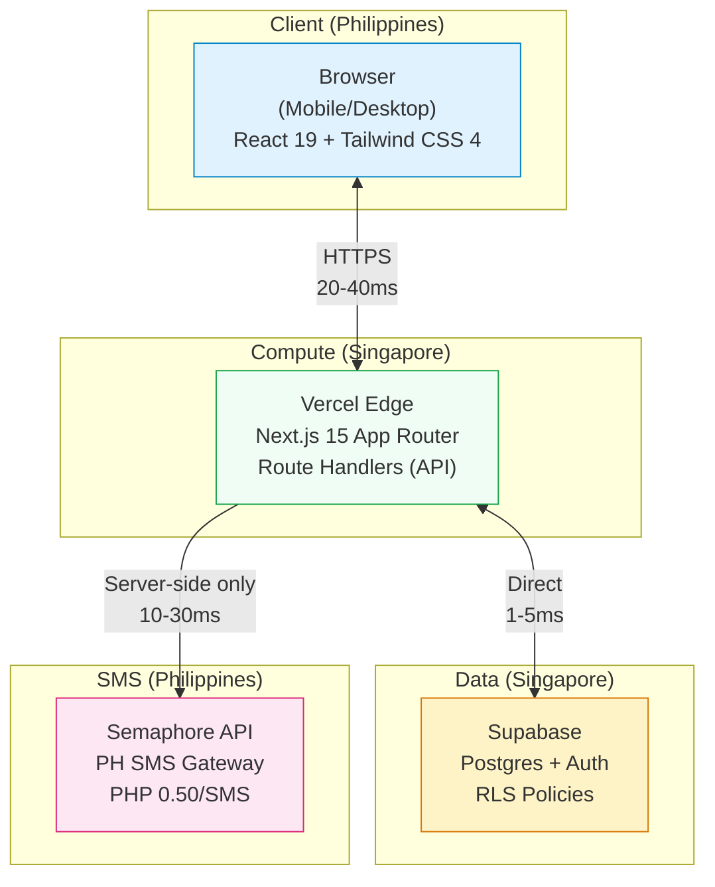
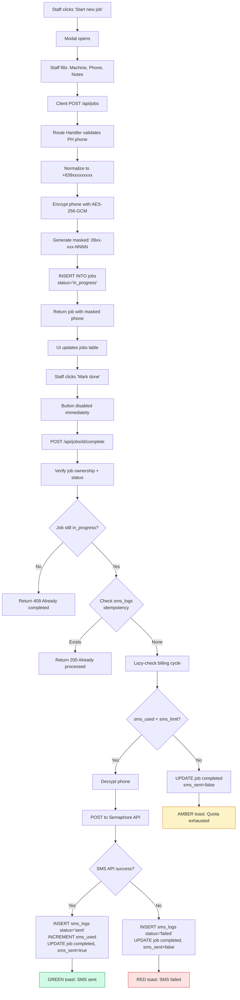
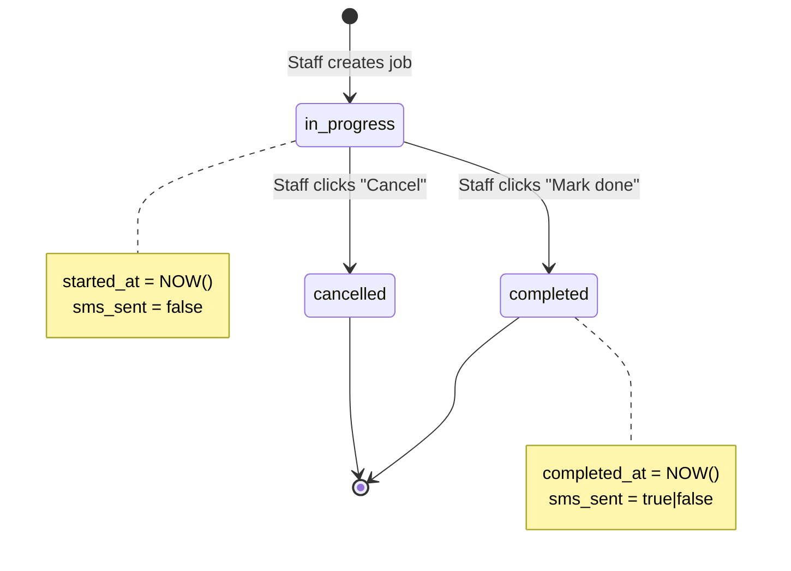
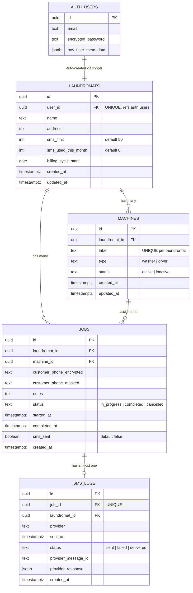

# LaundryPing -- Phase 1 MVP Product Requirements Document

---

| Field | Value |
|-------|-------|
| **Product** | LaundryPing |
| **Version** | 1.1 |
| **Date** | 2026-02-19 |
| **Status** | Final |
| **Authors** | Product Team (Research, Technical, Requirements Agents) |
| **Audience** | Implementing Engineers, Product Stakeholders |
| **Copyright** | 2026 LaundryPing |

---

## Table of Contents

1. [Product Overview](#1-product-overview)
2. [Problem Statement](#2-problem-statement)
3. [Target Users & Personas](#3-target-users--personas)
4. [Competitive Landscape](#4-competitive-landscape)
5. [Core User Stories](#5-core-user-stories)
6. [Functional Requirements](#6-functional-requirements)
7. [Non-Functional Requirements](#7-non-functional-requirements)
8. [Technical Architecture](#8-technical-architecture)
9. [Technology Stack](#9-technology-stack)
10. [Database Schema](#10-database-schema)
11. [SMS Integration](#11-sms-integration)
12. [UI/UX Integration Plan](#12-uiux-integration-plan)
13. [MoSCoW Prioritization & Acceptance Criteria](#13-moscow-prioritization--acceptance-criteria)
14. [Implementation Plan & Risk Register](#14-implementation-plan--risk-register)

---

## 1. Product Overview

### Vision Statement

Build a simple, low-friction web app for Philippine laundromats that sends "laundry done" notifications to customers, reduces front-desk hassle, and later grows into a booking/queue and analytics platform with SaaS revenue.

### Phase 1 Scope Summary

Phase 1 is a focused MVP ("LaundryPing SMS MVP") designed to validate a single hypothesis: **Philippine laundromat staff will use a lightweight web tool to notify customers via SMS when their laundry is done, replacing manual phone calls and paper logbooks.**

The MVP includes:
- Email/password authentication (one account per shop)
- Machine configuration (add/edit/delete washers and dryers)
- Job lifecycle management (start job, mark done)
- Automated SMS notification on job completion via Philippine SMS API
- Basic dashboard with today's jobs and SMS usage tracking
- Settings page for shop profile management
- Free tier of 50 SMS per month per laundromat

The MVP explicitly excludes: payment processing, multi-branch support, user roles, customer-facing features, booking/queue systems, analytics dashboards, native mobile apps, and IoT machine integration.

### Key Metrics for Success

| Metric | Target | Measurement Method |
|--------|--------|--------------------|
| Staff adoption rate | >80% of jobs logged through app (not paper) within first week at a pilot shop | Direct observation + DB job count vs. estimated daily loads |
| SMS delivery rate | >95% of sent SMS reach the customer's phone | Semaphore delivery logs + sms_logs table |
| Free-to-paid conversion | >5% of shops on free tier convert to paid within 60 days | Billing records once payment is implemented |
| Job creation speed | <15 seconds from "Start new job" tap to job saved | In-app timing or user observation during pilot |
| Page load performance | <2 seconds TTI on PH 4G mobile data | Lighthouse/WebPageTest from PH or simulated connection |
| Mark Done flow speed | <5 seconds from tap to SMS confirmation toast | In-app timing measurement |

---

## 2. Problem Statement

### The Core Pain: "Tapos na ba yung labada ko?"

Every day, thousands of Philippine laundromat customers ask the same question: "Is my laundry done yet?" The current state of customer notification in PH laundromats is remarkably primitive, creating friction for owners, staff, and customers alike.

### How Shops Currently Handle Notifications

- **Phone calls (most common):** Staff manually call the customer's cellphone number. This is time-consuming, unreliable (customers don't answer unknown numbers), and awkward. Staff often have to call 2-3 times before reaching someone. During peak hours (weekends, evenings), nobody has time to make calls at all.

- **Viber/Messenger messages (growing but fragmented):** Some shops use Viber or Facebook Messenger direct messages. This requires the customer to have a smartphone, a data connection, and the specific app installed. Staff manage multiple chat threads, messages get buried, and there is no structured tracking of who was notified and when.

- **"Come back in 2 hours" (the default):** The most common approach is simply telling the customer an estimated pickup time. Customers either come too early (and wait) or too late (laundry sits folded on a shelf, sometimes for days). This leads to unclaimed laundry, wasted shelf space, and unhappy customers.

- **Walk-ins / repeat visits:** Customers who live nearby just walk back and check. This wastes customer time and interrupts staff workflow.

- **Paper logbooks / tally sheets:** The vast majority of PH laundromats, especially independents outside major franchises, track jobs in paper logbooks. There is no system to trigger a notification. The "system" is the staff member's memory.

### Financial Impact on Shop Operations

- A small PH laundromat serves 30-50 customers per day, earning PHP 150-300 per transaction. Revenue depends on throughput -- how many loads cycle through machines per day.
- Unclaimed laundry sitting on shelves for hours (or days) blocks machine capacity. With 4 washers and 4 dryers, every delayed pickup means delayed loading of the next batch.
- "Is it done?" calls from customers interrupt staff during washing, folding, and sorting. A busy shop with 1-2 staff (the norm) can lose 60-90 minutes daily to status inquiries alone.
- Customer complaints about late notifications or missed pickups damage reputation. In the Philippines, word-of-mouth in the barangay and negative Facebook reviews can destroy a neighborhood laundromat.

### The Opportunity

Solve the notification problem with a tool so simple that a 19-year-old staff member on a PHP 500/day wage can operate it without training, and so cheap that an owner earning PHP 30,000-50,000/month net from the shop does not think twice about the cost.

---

## 3. Target Users & Personas

### Persona 1: The Owner ("Ate/Kuya Boss")

**Demographic Profile:**
- Age: 35-60 years old
- Often a husband-wife team, or a single owner-operator with another income source (sari-sari store, online selling, OFW spouse)
- Owns 1-3 laundry shops, typically in a residential neighborhood near a market, university, or boarding house cluster
- Capital investment: PHP 200K-800K for equipment (Electrolux, LG commercial, or second-hand machines). Franchise options like Save5 start at PHP 600K-1M+
- Net monthly profit per branch: PHP 15,000-50,000

**Tech Literacy:**
- Smartphone: Android (Samsung, Vivo, or Oppo in the PHP 5K-15K range)
- Uses Facebook daily (primary internet activity), GCash/Maya for payments
- Can navigate basic apps but gets frustrated with complex UIs, multiple steps, or English-heavy interfaces
- Has WiFi at the shop (PLDT Home or Converge, PHP 1,500-2,500/month) but it can be unreliable
- Comfortable with Globe/Smart prepaid load management

**What They Care About:**
- Making the shop look "professional" and "modern" without spending a lot
- Reducing customer complaints and "nasaan yung labada ko?" calls
- Simple reporting: How many loads today? How much revenue this week?
- SMS cost is a real concern. If the tool costs more than PHP 500-1,000/month, it will be scrutinized heavily against thin margins. The free tier at 50 SMS/month is critical for driving initial adoption.

**Language:** Taglish (Tagalog-English mix). The UI must feel natural in English but avoid jargon. "Start Job" is fine. "Initialize Service Instance" is not.

### Persona 2: The Staff / Attendant

**Demographic Profile:**
- Age: 18-30, often female, sometimes a relative of the owner
- Wage: PHP 400-610/day (minimum wage varies by region; NCR is approximately PHP 610)
- May be working solo during shifts, handling washing, drying, folding, cashiering, and customer inquiries simultaneously
- Education: High school or vocational graduate
- Typically 1-2 staff per shop

**Tech Literacy:**
- Smartphone-native. Uses TikTok, Facebook, Messenger, Mobile Legends daily on personal phone
- Typically on prepaid SIM (Globe, Smart, TNT, or TM) with data promos (GoSURF50, GIGA99) -- limited data budgets mean the app must be lightweight
- Very comfortable with touchscreen interfaces but has low patience for slow-loading pages
- Will NOT read instructions or onboarding tooltips. The UI must be self-explanatory at first glance
- Personal phone: budget Android (Realme, Vivo Y-series, Samsung A-series) with 2-4GB RAM, Android 10-13

**What They Care About:**
- **Speed:** The tool cannot slow them down. If it takes more than 30 seconds to log a job and send an SMS, they will stop using it and go back to the paper logbook. The workflow must be: tap, type number, tap, done.
- **Not getting blamed:** If the SMS fails, the staff needs clear visual confirmation. A toast saying "SMS sent to 0917XXXXXXX" protects them.
- **Not using their own phone credits:** Currently, many attendants text customers from their personal phones. They resent this. LaundryPing must send SMS through the system.
- **Minimal cognitive load:** During peak hours, they juggle 6-8 machines, multiple customer pickups, and phone calls. The app must be "tap, tap, done."

**Device Context:** They will most likely use the shop's device -- a cheap Android tablet, an old smartphone repurposed as a terminal, or the owner's laptop. The app must work well on Chrome on low-end Android (2-3GB RAM, Android 10+) over potentially slow WiFi.

### Persona 3: The Customer

**Demographic Profile:**
- Age: 18-55+, wide range
- Socioeconomic class C/D: boarding house residents (students, call center workers, factory workers), young families in apartments, kasambahay (helpers) dropping off employer's laundry
- Average spend per visit: PHP 80-300
- Repeat customers form the core of any neighborhood laundromat's business

**Phone/SIM Context:**
- Smartphone penetration: approximately 65% nationally, significantly higher in Metro Manila (~90%)
- Prepaid SIM dominance: approximately 95% of mobile subscribers are prepaid. Globe and Smart each have roughly 60 million subscribers; DITO has approximately 13 million
- After the SIM Registration Act (RA 11934, 2023), approximately 54 million unregistered SIMs were deactivated, making remaining active SIMs registered and valid -- improving SMS delivery reliability
- Customers routinely receive transactional SMS from GCash, Maya, banks, Grab, Lalamove, and Shopee. They know what a transactional text looks like and trust it.

**The Critical Insight About SMS Reach:**

SMS reaches every phone with an active SIM -- including PHP 500 feature phones that cannot run Viber or Messenger. In a market where a meaningful percentage of laundromat customers (especially older customers, helpers, and provincial residents) do not have smartphones, SMS is the only notification channel with true universal reach. SMS has a **98% open rate** globally, and Philippine data from Semaphore confirms that SMS remains "the communication method of choice for almost three-quarters of mobile consumers in the Philippines."

**What They Care About:**
- Getting notified when their laundry is actually ready
- Not being spammed. One text per job is the right amount.
- Privacy: They will give their phone number for the transaction (already standard practice) but do not want it stored or used for anything else.

**Language for SMS:** Taglish is ideal. A message like "Magandang araw po! Tapos na ang inyong labada sa [Shop Name]. Pwede na po kayong sunduin. Salamat po!" is perfect. Pure English is acceptable but slightly less warm. (Note: the final implementation uses a bilingual Tagalog/English template -- see Section 11 for the canonical SMS text.)

---

## 4. Competitive Landscape

### The Real Competitor: Analog Operations

LaundryPing's primary competitor is **the absence of any system at all**. An estimated 80-90% of independent PH laundromats use paper logbooks, notebooks, or basic Excel spreadsheets. Their "notification system" is a phone call from the attendant's personal phone, a Viber message, or nothing. LaundryPing is not displacing software. It is displacing a paper notebook and a phone call.

### International SaaS Solutions

**CleanCloud** (cleancloudapp.com)
- Pricing: $89/month/store (approximately PHP 5,000+/month) -- immediately disqualifying for 90%+ of PH independent laundromats
- SMS: Routes through Twilio at approximately $0.20/SMS to PH numbers (PHP 11+ per message, roughly 30x more expensive than local providers)
- PH market fit: Poor. Designed for US/UK dry cleaners doing $10K+ monthly revenue. No localization.

**TURNS** (turnsapp.com)
- Positioned as "premium" for "tech-forward operators" with AI-powered analytics and IoT integration
- PH market fit: Poor to moderate. Assumes the coin-operated self-service model common in the US, not the full-service model dominant in the Philippines.

**Other Global SaaS** (Starchup, Geelus, Quick Dry Cleaning, Cleantie, Focus Softnet)
- Various tools priced at $50-200/month, English-only, no PH SMS integration, no understanding of the Philippine market. None have meaningful PH presence.

### Local Philippine Solutions

**Franchise POS Systems** (Suds, Save5, The Laundry Doctor)
- Proprietary POS/CRM locked to franchise. Cannot buy software without franchise (PHP 300K-1M+ plus royalties).
- Represent only 5-10% of total PH laundry shop market.

**Viber/Messenger as Pseudo-Notification**
- Growing organically but fragmented. Requires customer app + data connection. No tracking, no analytics, uses staff personal accounts. Zero fallback for feature phone users.

**Manual SMS from Personal Phone**
- Some diligent staff text from personal prepaid SIM (PHP 1/SMS). Inconsistent, untrackable, frequently skipped during busy periods.

### Comparison Table

| Factor | LaundryPing | CleanCloud | Paper + Viber |
|--------|-------------|------------|---------------|
| Monthly cost | Free (50 SMS) to ~PHP 200-500 | PHP 5,000+ | Free but unscalable |
| Setup time | Minutes | Hours/days | N/A |
| SMS cost to PH numbers | PHP 0.50/msg via Semaphore | PHP 11+/msg via Twilio | Staff's personal load |
| Reaches feature phones | Yes (plain SMS) | Partially | Only if staff calls |
| Staff training needed | Near-zero (3-field form, 1-tap send) | Significant | None |
| PH-specific design | Yes (Taglish SMS, PH phone format) | No | N/A |
| Job tracking / analytics | Basic but useful | Comprehensive | None |
| Works on slow mobile data | Yes (lightweight web app) | Yes but heavier | N/A |
| Customer-side friction | Zero (no app, no signup) | Low (SMS/email) | Zero for calls, high for Viber |

### Key Positioning

**LaundryPing does not compete with CleanCloud. It competes with nothing.** The alternative is a paper notebook and a phone call. The bar for adoption is: (1) cheaper than phone calls, (2) faster than phone calls, (3) more reliable than phone calls. If LaundryPing clears that bar, it wins.

---

## 5. Core User Stories

The following user stories define the Phase 1 MVP scope. Each maps to functional requirements detailed in Section 6 and acceptance criteria in Section 13.

| # | User Story | Requirement Refs | AC Refs |
|---|-----------|-----------------|---------|
| US-01 | As staff, I can log into my shop account so that I can access the dashboard and manage jobs. | AUTH-01 to AUTH-06, AUTH-08 | AC-01, AC-02, AC-03, AC-04 |
| US-02 | As owner, I can configure my machines once (e.g., W1, W2, D1) so that staff can assign jobs to them. | MACH-01 to MACH-06 | AC-05, AC-06, AC-07 |
| US-03 | As staff, I can start a job by choosing a machine and entering the customer's mobile number so that the job is tracked in the system. | JOB-01 to JOB-05, JOB-13 | AC-08, AC-09 |
| US-04 | As staff, I can mark a job as "done" and trigger a single SMS to the customer so that they know their laundry is ready for pickup. | JOB-09, JOB-11, SMS-01 to SMS-08 | AC-10, AC-11, AC-12, AC-13 |
| US-05 | As owner, I can see today's jobs list (machine, times, status) for a quick overview of shop operations. | JOB-06 to JOB-08, JOB-10, DASH-01, DASH-08 | AC-14, AC-15 |
| US-06 | As owner, I can see how many SMS have been sent this month and how close I am to the free limit so that I can manage costs. | SMS-13 to SMS-15, DASH-03 | AC-14 |
| US-07 | As owner, I can update my shop name and address in settings. | SET-01, SET-02, SET-06 | AC-16 |

---

## 6. Functional Requirements

All requirements use the "The system shall..." format for testability. Requirements are organized by domain with priority labels (P0 = launch blocker, P1 = important, P2 = nice to have).

### 6.1 Authentication & Accounts

| ID | Requirement | Priority |
|----|-------------|----------|
| AUTH-01 | The system shall provide an email + password login form on the `/login` page with fields: "Email address" (type=email, required) and "Password" (type=password, required), and a "Log in" submit button. | P0 |
| AUTH-02 | The system shall authenticate users against Supabase Auth using email and password credentials upon form submission. | P0 |
| AUTH-03 | The system shall create a persistent session (Supabase session cookie/token) upon successful login that persists across page refreshes and browser tabs. | P0 |
| AUTH-04 | The system shall redirect unauthenticated users to `/login` when they attempt to access any protected route (dashboard, machines, settings, jobs, or any `/api/*` endpoint). | P0 |
| AUTH-05 | The system shall redirect already-authenticated users from `/login` to `/dashboard` automatically. | P0 |
| AUTH-06 | The system shall display an inline error message on the login form when credentials are invalid. The message shall not reveal whether the email or password specifically was incorrect (e.g., use "Invalid email or password"). | P0 |
| AUTH-07 | The system shall provide a password visibility toggle button (eye icon) on the login form that switches the password field between masked and plain text display. | P1 |
| AUTH-08 | The system shall provide a "Logout" button in the sidebar (visible on all authenticated pages) that destroys the server-side session, clears the client-side session, and redirects to `/login`. | P0 |
| AUTH-09 | The system shall enforce one shared account per laundromat in Phase 1 -- no user roles, no multi-user accounts, no RBAC. | P0 |
| AUTH-10 | The system shall expire inactive sessions after a configurable timeout period (default: 8 hours, aligned with PH laundromat staff shift duration). | P1 |
| AUTH-11 | When any API request returns HTTP 401 (session expired or invalid), the client shall redirect to `/login` with a toast: "Your session has expired. Please log in again." In-progress operations (e.g., Mark Done) shall NOT change job status on 401. | P0 |

### 6.2 Machine Management

| ID | Requirement | Priority |
|----|-------------|----------|
| MACH-01 | The system shall display a table of all machines belonging to the authenticated user's laundromat with columns: Label, Type, and Actions (edit, delete). | P0 |
| MACH-02 | The system shall allow the owner to add a new machine by providing: a label (non-empty string, max 20 characters, e.g., "W1") and a type (enum: "Washer" or "Dryer"). | P0 |
| MACH-03 | The system shall allow the owner to edit an existing machine's label and/or type via an edit action on the machine's table row. | P0 |
| MACH-04 | The system shall soft-delete a machine by setting its status to "inactive". Inactive machines shall not appear in the machines list, the job creation dropdown, or any active machine count. A confirmation step is required before soft-deletion. Historical jobs referencing the machine retain the association. | P0 |
| MACH-05 | The system shall prevent soft-deletion of a machine that currently has any job with `status = 'in_progress'` assigned to it, displaying: "Cannot delete -- this machine has active jobs." | P0 |
| MACH-06 | The system shall enforce unique machine labels within a single laundromat. Duplicate labels shall produce: "A machine with this label already exists." | P0 |
| MACH-07 | The system shall validate that machine labels are non-empty and do not exceed 20 characters. | P1 |
| MACH-08 | The system shall display the total machine count in a badge next to the "Machines" page header (e.g., "12 Total"). | P1 |
| MACH-09 | The system shall provide a search input that filters the machines table by label or type. | P2 |
| MACH-10 | The system shall provide tab-based filtering: All Machines, Washers, Dryers. | P2 |
| MACH-11 | The system shall display pagination controls when the total machine count exceeds 10. | P2 |
| MACH-12 | The system shall display summary statistics cards: Available count, Currently Running count. | P2 |
| MACH-13 | The system shall display each machine's status as a colored badge: Active (green), In Use (teal with pulse when a job is in_progress). | P1 |
| MACH-14 | The system shall provide an "Export" button for CSV export of the machines list. | P2 |
| MACH-15 | The system shall display "Cycles Today" and "Last Sync" columns for each machine. | P2 |
| MACH-16 | The system shall dynamically populate the Machine ID dropdown in the Start Job modal, excluding machines that currently have an active (in_progress) job. | P0 |

### 6.3 Job Lifecycle

| ID | Requirement | Priority |
|----|-------------|----------|
| JOB-01 | The system shall provide a "Start new job" button in the dashboard top bar that opens the Start Job modal. | P0 |
| JOB-02 | The Start Job modal shall contain: "Machine ID" dropdown (required), "Phone Number" text input (required), "Notes" textarea (optional), "Cancel" button, and "Start Job" submit button. | P0 |
| JOB-03 | The system shall validate that a machine is selected before allowing job creation, showing: "Please select a machine." | P0 |
| JOB-04 | The system shall validate the phone number as a valid PH mobile number: 11 digits starting with "09" or "+639XXXXXXXXX" format. Invalid formats show: "Please enter a valid Philippine mobile number (e.g., 09171234567)." | P0 |
| JOB-05 | On successful submission, the system shall create a job record with: `machine_id`, `customer_phone_encrypted` (AES-256-GCM), `customer_phone_masked` ("09xx-xxx-NNNN"), `notes`, `status = "in_progress"`, `started_at = NOW()`, and `laundromat_id`. | P0 |
| JOB-06 | The system shall display all jobs for the current calendar day in a "Today's Jobs" table with columns: Machine, Phone Number (masked), Status, Start Time, Done Time, Action. | P0 |
| JOB-07 | The system shall mask all customer phone numbers in UI and API responses using `09xx-xxx-NNNN` format. The full phone number shall never be sent to the client. | P0 |
| JOB-08 | The system shall display "In progress" jobs with an amber badge and "Completed" jobs with a teal badge. | P0 |
| JOB-09 | The system shall display a "Mark done" button for each job with `status = "in_progress"`. | P0 |
| JOB-10 | The system shall display a grey check icon for each job with `status = "completed"`. | P0 |
| JOB-11 | When "Mark done" is clicked, the system shall update the job: `status = "completed"`, `completed_at = NOW()`. This update occurs regardless of SMS outcome. | P0 |
| JOB-12 | For in-progress jobs, the Done Time column shall display a dash or empty value (no time estimation in Phase 1). | P1 |
| JOB-13 | The system shall prevent starting a new job on a machine that already has an active job. | P0 |
| JOB-14 | The Start Job modal shall close on Cancel, X button, Escape key, or click outside. | P1 |
| JOB-15 | The system shall display a "Live updating" indicator in the Today's Jobs table header. | P2 |
| JOB-16 | The system shall provide a "View all historical jobs" link below the Today's Jobs table. | P2 |
| JOB-17 | Jobs in the Today's Jobs table shall be sorted by Start Time descending (most recent first). | P1 |
| JOB-18 | The Today's Jobs table shall additionally display any in_progress jobs from previous days with a red "Overdue" badge, shown above today's jobs. | P1 |
| JOB-19 | Staff shall be able to mark overdue in_progress jobs as completed via the same "Mark done" flow. | P1 |
| JOB-20 | If all machines have active jobs, the Start Job modal shall display: "All machines are currently in use. Mark a job as done to free up a machine." with the Start Job button disabled. If no machines exist, show: "No machines configured yet. Go to Machines to add your first machine." | P0 |
| JOB-21 | The system shall provide a "Cancel" action for in_progress jobs. Cancelled jobs: `status='cancelled'`, no SMS sent, machine freed. Displayed with grey "Cancelled" badge in Today's Jobs. | P1 |

### 6.4 SMS Sending & Quota

| ID | Requirement | Priority |
|----|-------------|----------|
| SMS-01 | When a job is marked done, the system shall check the laundromat's `sms_used_this_month` against `sms_limit` (default: 50 per month). | P0 |
| SMS-02 | If quota is available, the system shall call the Semaphore SMS API to send a notification to the customer's decrypted phone number. Decryption occurs server-side only. | P0 |
| SMS-03 | The SMS shall use the bilingual Tagalog/English template defined in Section 11 (SMS Template). The template must fit within a single 160-character GSM-7 SMS segment. Shop names exceeding 25 characters shall be truncated with ellipsis in the SMS template to guarantee single-segment delivery. | P0 |
| SMS-04 | On successful SMS delivery (API 2xx), the system shall increment `sms_used_this_month` by exactly 1. | P0 |
| SMS-05 | On successful SMS, the system shall display a green success toast: "SMS sent to customer." (with period, dismissible) | P0 |
| SMS-06 | If quota is exhausted, the system shall NOT call the SMS API and shall display an amber warning: "Free SMS limit reached (X/Y). Please inform the customer manually." The job is still marked completed. | P0 |
| SMS-07 | If the SMS API fails, the system shall still mark the job completed, display a red error toast: "SMS delivery failed. Please inform the customer manually." The `sms_used_this_month` counter shall NOT be incremented. | P0 |
| SMS-08 | The system shall implement idempotency to guarantee no duplicate SMS per job. Three layers: (1) UI button disable on click, (2) application-level sms_logs check, (3) database UNIQUE constraint on sms_logs.job_id. | P0 |
| SMS-09 | The system shall reset `sms_used_this_month` to 0 at the start of each billing cycle using a lazy check-on-read approach. The reset shall be triggered both during "Mark done" and when dashboard or settings page loads SMS usage data. | P0 |
| SMS-10 | The system shall log every SMS attempt in an `sms_logs` table with: job_id, laundromat_id, provider, status, provider_message_id, provider_response, sent_at. | P1 |
| SMS-11 | The system shall NOT retry SMS delivery automatically. Failed SMS is considered undeliverable. | P1 |
| SMS-12 | The success toast shall be dismissible by clicking Dismiss or the X icon. | P1 |
| SMS-13 | The dashboard shall display SMS quota usage: "X / Y messages" with a horizontal progress bar. | P0 |
| SMS-14 | The dashboard shall display "Plan resets in X days" below the SMS progress bar. | P1 |
| SMS-15 | The SMS progress bar shall change color: teal at normal usage, amber at 80%, red at 100%. | P1 |
| SMS-16 | The SMS API call shall have a timeout of 5 seconds using AbortController. If the provider does not respond within 5 seconds, treat as failure (same as SMS-07). | P0 |

### 6.5 Dashboard & Analytics

| ID | Requirement | Priority |
|----|-------------|----------|
| DASH-01 | The system shall display a "Jobs completed today" stats card. | P0 |
| DASH-02 | The "Jobs completed today" card shall show a percentage change compared to the previous day. | P1 |
| DASH-03 | The system shall display an "SMS sent this month" stats card with usage count, limit, progress bar, and reset countdown. | P0 |
| DASH-04 | The system shall display the laundromat name in the dashboard top bar header. | P0 |
| DASH-05 | The system shall display the user's initials in a circular avatar badge in the top bar. | P1 |
| DASH-06 | The system shall render a sidebar: Dashboard, Jobs, Machines, Settings, Plan & Billing (locked), Logout (bottom, red). | P0 |
| DASH-07 | The "Plan & Billing" sidebar item shall be greyed out with a lock icon and non-clickable. | P1 |
| DASH-08 | The Today's Jobs table shall display only jobs from the current calendar day. | P0 |
| DASH-09 | The system shall log jobs created per day and SMS sent per day per laundromat for analytics. | P1 |

### 6.6 Settings

| ID | Requirement | Priority |
|----|-------------|----------|
| SET-01 | The Settings page shall display editable "Laundromat Name" and "Business Address" fields. | P1 |
| SET-02 | The system shall persist name/address changes on "Save Changes" click with success/error feedback. | P1 |
| SET-03 | The Settings page shall display a read-only SMS usage summary with three cards: Sent this month, Remaining credits, Billing period. | P1 |
| SET-04 | SMS usage data on Settings shall be dynamically queried and consistent with the dashboard. | P1 |
| SET-05 | The Settings page shall display a "Plan & Billing" placeholder section (greyed out, "Coming Soon" badge, non-interactive). | P2 |
| SET-06 | The system shall validate that laundromat name is not empty and does not exceed 50 characters. | P1 |

---

## 7. Non-Functional Requirements

| ID | Category | Requirement | Target | Rationale |
|----|----------|-------------|--------|-----------|
| NFR-01 | Performance | All pages shall achieve TTI under 2 seconds on PH 4G (9 Mbps, 170ms RTT). | <2s on 4G, <3s on 3G | Staff on mobile devices; slow loads disrupt workflow. |
| NFR-02 | Performance | "Mark done" click to SMS confirmation toast shall complete in under 5 seconds. | <5s end-to-end | Staff need prompt confirmation to move to next task. |
| NFR-03 | Performance | Initial JavaScript bundle (gzipped) shall be under 200KB. | <200KB gzipped | PH mobile data is limited and metered. |
| NFR-04 | Security | Phone numbers shall be masked in ALL UI and API responses as `09xx-xxx-NNNN`. | 100% coverage | PH Data Privacy Act (RA 10173). |
| NFR-05 | Security | Phone numbers shall be encrypted at rest using AES-256-GCM (application-level). Keys in server-side env vars only. | AES-256-GCM | Protects PII in case of database breach. |
| NFR-06 | Security | Session tokens shall be httpOnly, Secure, SameSite=Lax cookies. | All three flags | Prevents XSS session theft on shared devices. |
| NFR-07 | Security | All tables shall have RLS policies ensuring users access only their own laundromat's data. | 100% RLS coverage | Multi-tenant security from day 1. |
| NFR-08 | Security | All `/api/*` endpoints shall require valid Supabase JWT. Missing/invalid tokens return HTTP 401. | 100% API protection | Prevents unauthenticated access. |
| NFR-09 | Security | Sessions shall timeout after configurable inactivity period. | Default: 8 hours | Aligns with PH laundromat shift duration. |
| NFR-10 | Reliability | Idempotent SMS sending: zero duplicate SMS per job under any condition. | Zero duplicates | Double-texting wastes quota and is unprofessional. |
| NFR-11 | Reliability | Graceful degradation when SMS API is down: jobs still complete, staff sees clear error. | 100% job completion regardless of SMS | Core operation must never be blocked by third-party failure. |
| NFR-12 | Reliability | "Mark done" button disabled within 100ms of first click to prevent double-submission. | <100ms disable | Prevents accidental double-submissions on slow connections. |
| NFR-13 | Reliability | SMS quota check and increment shall be performed using the `check_and_increment_sms_quota()` Postgres function via `supabase.rpc()`, ensuring row-level locking within a single transaction. | Zero over-quota SMS | Concurrent requests must not race past quota. |
| NFR-14 | Responsiveness | All pages functional on 375px (iPhone SE) to 1920px (desktop). | Full range | PH staff frequently use personal smartphones. |
| NFR-15 | Compliance | Only one transactional SMS per job completion. No marketing messages. | 1 SMS per Mark Done | PH anti-spam regulations; verbal consent for transactional only. |
| NFR-16 | Compliance | SMS shall include laundromat name for sender identification. | Shop name in every SMS | Customer trust and regulatory compliance. |
| NFR-17 | Scalability | Multi-tenant schema from day 1 (all tables include `laundromat_id`). | All tables | Avoids costly migration for Phase 2. |
| NFR-18 | Hosting | Deploy on Vercel (sin1 region) + Supabase (ap-southeast-1 Singapore). | Singapore region | <50ms DB latency to PH users. |
| NFR-19 | Accessibility | All interactive elements: minimum 44x44 CSS pixel touch targets. | 44x44px minimum | Staff operate app with damp hands in laundromat. |
| NFR-20 | Accessibility | Keyboard navigation: Tab to focus, Enter to activate, Escape to close modals. Visible focus indicators. | WCAG 2.1 AA | Usability for keyboard/assistive device users. |
| NFR-21 | Availability | Target 99.5% uptime (~3.65 hours downtime/month). | >=99.5% | Laundromats operate 7 days/week. |
| NFR-22 | Security | All mutation API endpoints shall implement rate limiting of no more than 60 requests per minute per authenticated session. Excessive requests return HTTP 429. | 60 req/min | Prevents SMS credit depletion and database abuse via exposed anon key. |
| NFR-23 | Security | Maximum active (in_progress) jobs per laundromat: 20 (or 2x machine count, whichever is greater). | 20 max active jobs | Prevents bulk job creation abuse. |
| NFR-24 | Security | All user-provided text inputs shall be sanitized server-side before storage. HTML tags stripped. Laundromat name: alphanumeric, spaces, hyphens, ampersands, apostrophes, periods, parentheses only. Max lengths: name 50, address 200, notes 500, machine label 20. | 100% sanitized | Prevents XSS and SMS injection. |
| NFR-25 | Security | No component shall use `dangerouslySetInnerHTML` for user-provided content. All user text rendered via React's default JSX escaping. | Zero raw HTML | Prevents stored XSS. |

---

## 8. Technical Architecture

### System Topology



### Layer Interaction Details

1. **Browser (Client):** React 19 SPA with App Router. All pages server-rendered on first load (SSR/RSC) for performance on PH mobile data. Client Components handle interactive elements (modals, buttons, toasts).

2. **Vercel (Compute):** Next.js 15 App Router with Route Handlers as the API layer. Server Components fetch data directly via Supabase server client. Route Handlers handle mutations. SMS sending happens exclusively server-side -- never from the client.

3. **Supabase (Data + Auth):** Postgres in `ap-southeast-1` (Singapore). Supabase Auth handles email/password. RLS ensures tenant isolation. Phone numbers encrypted at application level before storage.

4. **SMS Provider:** Called exclusively from Vercel serverless functions. API keys stored in Vercel environment variables, never exposed to client.

### Data Flow: Create Job -> Mark Done -> Send SMS



### Job Lifecycle State Diagram



### API Route Structure

```
app/
  api/
    auth/
      signup/route.ts          POST - Register new laundromat account
      callback/route.ts        GET  - Supabase auth callback
    jobs/
      route.ts                 GET  - List today's jobs (query: ?date=today)
                               POST - Create new job
      [id]/
        complete/route.ts      POST - Mark job done + trigger SMS
    machines/
      route.ts                 GET  - List machines for laundromat
                               POST - Add new machine
      [id]/route.ts            PUT  - Edit machine
                               DELETE - Delete machine
    settings/
      route.ts                 GET  - Get laundromat settings
                               PUT  - Update laundromat settings
    sms/
      usage/route.ts           GET  - Get current month SMS usage
```

### Page Route Structure

```
app/
  (auth)/
    login/page.tsx             Login screen
    signup/page.tsx            Signup screen
  (dashboard)/
    layout.tsx                 Sidebar + top bar layout (shared)
    page.tsx                   Dashboard overview (default route)
    jobs/page.tsx              Jobs list (routes to dashboard in Phase 1)
    machines/page.tsx          Machines management
    settings/page.tsx          Settings page
```

### Authentication Flow

```
Signup: email + password + shop_name
  -> Supabase Auth signUp({ metadata: { shop_name }})
  -> creates auth.users row
  -> trigger: on_auth_user_created() inserts into laundromats table
  -> redirect to /dashboard

Login: email + password
  -> Supabase Auth signInWithPassword()
  -> sets session cookie via @supabase/ssr
  -> redirect to /dashboard

Middleware: middleware.ts checks session on every route
  -> if no session + (dashboard) routes -> redirect to /login
  -> if session + (auth) routes -> redirect to /dashboard
```

---

## 9. Technology Stack

All versions verified as of 2026-02-19.

### Core Dependencies

| Package | Exact Version | Purpose |
|---------|--------------|---------|
| Node.js | 22.22.0 LTS | Runtime. Maintenance LTS, EOL 2027-04-30. |
| Next.js | 15.5.x | Framework. App Router, Turbopack builds. |
| React | 19.0.x | UI library. Server Components, Actions. |
| React DOM | 19.0.x | DOM renderer. Must match React version. |
| TypeScript | 5.9.3 | Type safety. Latest stable. |
| Tailwind CSS | 4.2.0 | Utility-first CSS. Oxide engine, CSS-first config. |
| @tailwindcss/postcss | 4.x | PostCSS plugin for Tailwind 4 with Next.js. |
| @supabase/supabase-js | 2.97.x | Supabase client for Postgres, Auth, Realtime. |
| @supabase/ssr | 0.8.0 | Cookie-based auth for Next.js SSR. |
| shadcn/ui | latest (CLI) | Accessible component primitives (not an npm dep). |

### Dev Dependencies

| Package | Version | Purpose |
|---------|---------|---------|
| eslint | 9.x | Linting with flat config. |
| eslint-config-next | 15.x | Next.js-specific ESLint rules. |
| prettier | 3.x | Code formatting. |
| prettier-plugin-tailwindcss | latest | Automatic Tailwind class sorting. |

### UI Dependencies (via shadcn/ui)

| Package | Installed By | Purpose |
|---------|-------------|---------|
| @radix-ui/* | shadcn/ui CLI | Accessible primitives (Dialog, Select, AlertDialog). |
| lucide-react | shadcn/ui CLI | Icon library (tree-shakeable). |
| class-variance-authority | shadcn/ui CLI | Component variant management. |
| clsx + tailwind-merge | shadcn/ui CLI | Conditional class merging. |
| sonner | shadcn/ui CLI (toast) | Toast notification library. |
| react-hook-form + @hookform/resolvers | Manual install | Form handling. |
| zod | Manual install | Schema validation for forms and API inputs. |

### Fonts & Icons

| Asset | Source | Notes |
|-------|--------|-------|
| Inter | `next/font/google` | Self-hosted by Next.js for zero CLS and fast load. Used in all mockups. |
| Lucide React | shadcn/ui default | **Replaces Material Symbols Outlined** from mockups. Tree-shakeable (~50KB used vs 200KB+ font file). |

### Compatibility Matrix

| Package | Version | Compatible With | Notes |
|---------|---------|----------------|-------|
| Next.js | 15.5.x | React 19, Node 22, TS 5.9, TW 4 | Stable App Router. Turbopack dev is default. |
| React | 19.0.x | Next.js 15.5.x | Required minimum for Next.js 15. |
| Tailwind CSS | 4.2.0 | Next.js 15.5.x | Via `@tailwindcss/postcss`. No `tailwind.config.js`. |
| shadcn/ui | latest | React 19, Next.js 15, TW 4 | Full compatibility confirmed. |
| @supabase/supabase-js | 2.97.x | Next.js 15 | Works in Server/Client Components and Route Handlers. |
| @supabase/ssr | 0.8.0 | Next.js 15, supabase-js 2.x | Designed for App Router. |
| TypeScript | 5.9.3 | Next.js 15, React 19 | Full React 19 type support. |

### Key Decisions Log

| # | Decision | Choice | Alternatives Considered | Rationale |
|---|----------|--------|------------------------|-----------|
| 1 | Next.js version | 15.5.x | 16.1.x (latest) | Stability for MVP. Proven @supabase/ssr compatibility. 16 may have edge cases. |
| 2 | SMS provider | Semaphore (primary) | PhilSMS, Twilio, Vonage | Best PH dev community. Simple API. All PH networks. PHP 0.50/SMS. |
| 3 | Phone encryption | App-level AES-256-GCM | pgcrypto extension | Key never touches DB. Easier rotation. Smaller breach blast radius. |
| 4 | SMS quota reset | Lazy check (Phase 1) | pg_cron (requires Pro) | Works on Supabase free tier. |
| 5 | Component library | shadcn/ui | MUI, Ant Design, Mantine | Copy-paste ownership. TW4 native. Accessible via Radix. Not runtime dep. |
| 6 | Icons | Lucide React | Material Symbols (in mockups) | Tree-shakeable (~50KB vs 200KB+). shadcn/ui default. |
| 7 | Auth approach | Supabase Auth (email/pwd) | NextAuth, Clerk, custom | Zero custom auth. Built-in session. Bundled with DB. Free tier. |
| 8 | RLS strategy | user_id via laundromats subquery | Direct column check | Single pattern for all tenant isolation. Future-proof for multi-user. |
| 9 | SMS sending location | Server-only (Route Handlers) | Client-side, Edge Functions | API keys never exposed. Prevents client manipulation. |
| 10 | Vercel region | sin1 (Singapore) | Default (US), hkg1 (HK) | Co-located with Supabase Singapore. Lowest PH latency. |
| 11 | Toast library | Sonner (via shadcn/ui) | React Hot Toast, custom | Built-in shadcn/ui integration. Three variants needed. |
| 12 | Form handling | react-hook-form + Zod | Formik, native forms | Best React 19 DX. Runtime + type-level validation. |

### Tailwind CSS 4 Migration Notes

The HTML mockups use Tailwind via CDN with a v3-style config. Key changes for Tailwind 4:

1. **No `tailwind.config.js`**: Custom theme values move to CSS via `@theme` directives in `globals.css`.
2. **PostCSS plugin**: Use `@tailwindcss/postcss` instead of the old `tailwindcss` plugin.
3. **Color format**: shadcn/ui uses OKLCH. The custom primary `#0d968b` needs OKLCH conversion.
4. **Class compatibility**: Utility classes in mockups (`bg-primary/10`, `rounded-xl`, etc.) are fully compatible.
5. **`@apply` still works** but `@theme` replaces `theme.extend`.

---

## 10. Database Schema

### Entity Relationship Diagram



### Table Definitions

#### `laundromats`

```sql
CREATE TABLE laundromats (
    id UUID PRIMARY KEY DEFAULT gen_random_uuid(),
    user_id UUID NOT NULL REFERENCES auth.users(id) ON DELETE CASCADE,
    name TEXT NOT NULL,
    address TEXT,
    sms_limit INTEGER NOT NULL DEFAULT 50,
    sms_used_this_month INTEGER NOT NULL DEFAULT 0,
    billing_cycle_start DATE NOT NULL DEFAULT date_trunc('month', CURRENT_DATE)::date,
    created_at TIMESTAMPTZ NOT NULL DEFAULT now(),
    updated_at TIMESTAMPTZ NOT NULL DEFAULT now(),

    CONSTRAINT laundromats_user_id_unique UNIQUE (user_id)
);

CREATE INDEX idx_laundromats_user_id ON laundromats(user_id);
```

**Notes:**
- `user_id` links to Supabase Auth's `auth.users.id`. One laundromat per user (Phase 1).
- `sms_limit` defaults to 50 (free tier). Can be raised for paid tiers later.
- `sms_used_this_month` incremented atomically on each successful SMS send.
- `billing_cycle_start` used for lazy monthly reset detection.

#### `machines`

```sql
CREATE TABLE machines (
    id UUID PRIMARY KEY DEFAULT gen_random_uuid(),
    laundromat_id UUID NOT NULL REFERENCES laundromats(id) ON DELETE CASCADE,
    label TEXT NOT NULL,
    type TEXT NOT NULL CHECK (type IN ('washer', 'dryer')),
    status TEXT NOT NULL DEFAULT 'active' CHECK (status IN ('active', 'inactive')),
    created_at TIMESTAMPTZ NOT NULL DEFAULT now(),
    updated_at TIMESTAMPTZ NOT NULL DEFAULT now(),

    CONSTRAINT machines_laundromat_label_unique UNIQUE (laundromat_id, label)
);

CREATE INDEX idx_machines_laundromat_id ON machines(laundromat_id);
```

**Notes:**
- `label` is the short name like "W1", "D2". Must be unique within a laundromat.
- `type` constrained to 'washer' or 'dryer'.
- `status` is 'active' or 'inactive'. Mockup statuses ("In Use", "Offline", "Maintenance") deferred to Phase 2.

#### `jobs`

```sql
CREATE TABLE jobs (
    id UUID PRIMARY KEY DEFAULT gen_random_uuid(),
    laundromat_id UUID NOT NULL REFERENCES laundromats(id) ON DELETE CASCADE,
    machine_id UUID NOT NULL REFERENCES machines(id) ON DELETE RESTRICT,
    customer_phone_encrypted TEXT NOT NULL,
    customer_phone_masked TEXT NOT NULL,
    notes TEXT,
    status TEXT NOT NULL DEFAULT 'in_progress'
        CHECK (status IN ('in_progress', 'completed', 'cancelled')),
    started_at TIMESTAMPTZ NOT NULL DEFAULT now(),
    completed_at TIMESTAMPTZ,
    sms_sent BOOLEAN NOT NULL DEFAULT false,
    created_at TIMESTAMPTZ NOT NULL DEFAULT now()
);

CREATE INDEX idx_jobs_laundromat_id ON jobs(laundromat_id);
CREATE INDEX idx_jobs_laundromat_started ON jobs(laundromat_id, started_at DESC);
CREATE INDEX idx_jobs_status ON jobs(status) WHERE status = 'in_progress';
```

**Notes:**
- `customer_phone_encrypted` stores AES-256-GCM encrypted phone. Never sent to client.
- `customer_phone_masked` stores display-safe format. Sent to client for UI.
- `machine_id` uses ON DELETE RESTRICT -- cannot delete a machine that has jobs.
- Concurrent "mark done" handled via `UPDATE ... WHERE status = 'in_progress'` returning 0 rows if already completed.

#### `sms_logs`

```sql
CREATE TABLE sms_logs (
    id UUID PRIMARY KEY DEFAULT gen_random_uuid(),
    job_id UUID NOT NULL REFERENCES jobs(id) ON DELETE CASCADE,
    laundromat_id UUID NOT NULL REFERENCES laundromats(id) ON DELETE CASCADE,
    provider TEXT NOT NULL,
    sent_at TIMESTAMPTZ NOT NULL DEFAULT now(),
    status TEXT NOT NULL CHECK (status IN ('sent', 'failed', 'delivered')),
    provider_message_id TEXT,
    provider_response JSONB,
    created_at TIMESTAMPTZ NOT NULL DEFAULT now(),

    CONSTRAINT sms_logs_job_id_unique UNIQUE (job_id)
);

CREATE INDEX idx_sms_logs_laundromat_id ON sms_logs(laundromat_id);
```

**Notes:**
- The UNIQUE constraint on `job_id` is the database-level idempotency guard. A second INSERT for the same job fails with a constraint violation, preventing double-send.
- `provider_response` stores full JSON from Semaphore for debugging.

### Row Level Security (RLS) Policies

```sql
-- Enable RLS on all tables
ALTER TABLE laundromats ENABLE ROW LEVEL SECURITY;
ALTER TABLE machines ENABLE ROW LEVEL SECURITY;
ALTER TABLE jobs ENABLE ROW LEVEL SECURITY;
ALTER TABLE sms_logs ENABLE ROW LEVEL SECURITY;

-- LAUNDROMATS
CREATE POLICY "Users can view own laundromat"
    ON laundromats FOR SELECT
    USING (user_id = auth.uid());

CREATE POLICY "Users can update own laundromat"
    ON laundromats FOR UPDATE
    USING (user_id = auth.uid())
    WITH CHECK (user_id = auth.uid());

-- MACHINES
CREATE POLICY "Users can view own machines"
    ON machines FOR SELECT
    USING (laundromat_id IN (
        SELECT id FROM laundromats WHERE user_id = auth.uid()
    ));

CREATE POLICY "Users can insert own machines"
    ON machines FOR INSERT
    WITH CHECK (laundromat_id IN (
        SELECT id FROM laundromats WHERE user_id = auth.uid()
    ));

CREATE POLICY "Users can update own machines"
    ON machines FOR UPDATE
    USING (laundromat_id IN (
        SELECT id FROM laundromats WHERE user_id = auth.uid()
    ))
    WITH CHECK (laundromat_id IN (
        SELECT id FROM laundromats WHERE user_id = auth.uid()
    ));

CREATE POLICY "Users can delete own machines"
    ON machines FOR DELETE
    USING (laundromat_id IN (
        SELECT id FROM laundromats WHERE user_id = auth.uid()
    ));

-- JOBS
CREATE POLICY "Users can view own jobs"
    ON jobs FOR SELECT
    USING (laundromat_id IN (
        SELECT id FROM laundromats WHERE user_id = auth.uid()
    ));

CREATE POLICY "Users can insert own jobs"
    ON jobs FOR INSERT
    WITH CHECK (laundromat_id IN (
        SELECT id FROM laundromats WHERE user_id = auth.uid()
    ));

CREATE POLICY "Users can update own jobs"
    ON jobs FOR UPDATE
    USING (laundromat_id IN (
        SELECT id FROM laundromats WHERE user_id = auth.uid()
    ));

-- SMS_LOGS (read-only for users; inserts via service role)
CREATE POLICY "Users can view own sms logs"
    ON sms_logs FOR SELECT
    USING (laundromat_id IN (
        SELECT id FROM laundromats WHERE user_id = auth.uid()
    ));
```

### Database Trigger: Auto-Create Laundromat on Signup

```sql
CREATE OR REPLACE FUNCTION handle_new_user()
RETURNS TRIGGER AS $$
BEGIN
    INSERT INTO laundromats (user_id, name)
    VALUES (
        NEW.id,
        COALESCE(NEW.raw_user_meta_data->>'shop_name', 'My Laundromat')
    );
    RETURN NEW;
END;
$$ LANGUAGE plpgsql SECURITY DEFINER;

CREATE TRIGGER on_auth_user_created
    AFTER INSERT ON auth.users
    FOR EACH ROW
    EXECUTE FUNCTION handle_new_user();
```

When `supabase.auth.signUp({ email, password, options: { data: { shop_name: 'Spin & Go' } } })` is called, this trigger auto-creates the laundromat row with the shop name from user metadata.

### Monthly SMS Counter Reset (Lazy Check)

The lazy reset works on Supabase free tier without pg_cron. The reset is performed using an idempotent stored procedure to prevent race conditions:

```sql
CREATE OR REPLACE FUNCTION ensure_billing_cycle(p_laundromat_id UUID)
RETURNS VOID AS $$
BEGIN
  UPDATE laundromats
  SET sms_used_this_month = 0,
      billing_cycle_start = date_trunc('month', CURRENT_DATE)::date,
      updated_at = now()
  WHERE id = p_laundromat_id
    AND billing_cycle_start < date_trunc('month', CURRENT_DATE)::date;
END;
$$ LANGUAGE plpgsql;
```

The `WHERE billing_cycle_start < ...` clause makes this idempotent -- if another request already reset it, this is a no-op.

Called from TypeScript via `supabase.rpc('ensure_billing_cycle', { p_laundromat_id: laundromatId })` in both the "Mark done" Route Handler and the `GET /api/sms/usage` endpoint (to ensure the dashboard displays the correct count on the first of each month).

Optional pg_cron (Supabase Pro plan):

```sql
SELECT cron.schedule(
    'reset-monthly-sms-counters',
    '0 16 1 * *',  -- 16:00 UTC = 00:00 PHT on the 1st of each month
    $$
    UPDATE laundromats
    SET sms_used_this_month = 0,
        billing_cycle_start = date_trunc('month', CURRENT_DATE)::date,
        updated_at = now();
    $$
);
```

### SMS Quota Check (Stored Procedure)

The SMS quota check and increment must be performed atomically with row-level locking to prevent race conditions when concurrent "Mark done" requests arrive:

```sql
CREATE OR REPLACE FUNCTION check_and_increment_sms_quota(p_laundromat_id UUID)
RETURNS BOOLEAN AS $$
DECLARE
  v_used INTEGER;
  v_limit INTEGER;
BEGIN
  SELECT sms_used_this_month, sms_limit INTO v_used, v_limit
    FROM laundromats WHERE id = p_laundromat_id FOR UPDATE;
  IF v_used >= v_limit THEN
    RETURN FALSE;
  END IF;
  UPDATE laundromats SET sms_used_this_month = sms_used_this_month + 1,
    updated_at = now() WHERE id = p_laundromat_id;
  RETURN TRUE;
END;
$$ LANGUAGE plpgsql;
```

Called from TypeScript via `supabase.rpc('check_and_increment_sms_quota', { p_laundromat_id: laundromatId })`. Returns `true` if quota is available (and increments the counter), `false` if exhausted.

### Phone Number Encryption

```typescript
// lib/crypto.ts
import { createCipheriv, createDecipheriv, randomBytes } from 'crypto';

const ALGORITHM = 'aes-256-gcm';
const KEY = Buffer.from(process.env.PHONE_ENCRYPTION_KEY!, 'hex'); // 32 bytes

export function encryptPhone(phone: string): string {
    const iv = randomBytes(16);
    const cipher = createCipheriv(ALGORITHM, KEY, iv);
    let encrypted = cipher.update(phone, 'utf8', 'hex');
    encrypted += cipher.final('hex');
    const authTag = cipher.getAuthTag().toString('hex');
    return `${iv.toString('hex')}:${authTag}:${encrypted}`;
}

export function decryptPhone(encrypted: string): string {
    const [ivHex, authTagHex, ciphertext] = encrypted.split(':');
    const decipher = createDecipheriv(ALGORITHM, KEY, Buffer.from(ivHex, 'hex'));
    decipher.setAuthTag(Buffer.from(authTagHex, 'hex'));
    let decrypted = decipher.update(ciphertext, 'hex', 'utf8');
    decrypted += decipher.final('utf8');
    return decrypted;
}

export function maskPhone(phone: string): string {
    // +639171234567 -> 09xx-xxx-4567
    // 09171234567   -> 09xx-xxx-4567
    const digits = phone.replace(/\D/g, '');
    const last4 = digits.slice(-4);
    return `09xx-xxx-${last4}`;
}
```

Key generation: `openssl rand -hex 32` (produces 64 hex chars = 32 bytes)

**Key Rotation Strategy (Phase 1 Minimum):** If decryption fails (e.g., due to key mismatch after rotation), the system shall log the error, skip the SMS, mark the job as completed with `sms_sent=false`, and show the staff an error toast: "Unable to send SMS. Please inform the customer manually." Phase 2 shall implement key versioning: prefix encrypted values with `v1:`, maintain `PHONE_ENCRYPTION_KEY_PREVIOUS` for fallback decryption, and provide a migration script to re-encrypt records with the new key.

### Supabase Client Setup

```typescript
// lib/supabase/server.ts
import { createServerClient } from '@supabase/ssr';
import { cookies } from 'next/headers';

export async function createClient() {
    const cookieStore = await cookies();
    return createServerClient(
        process.env.NEXT_PUBLIC_SUPABASE_URL!,
        process.env.NEXT_PUBLIC_SUPABASE_ANON_KEY!,
        {
            cookies: {
                getAll() { return cookieStore.getAll(); },
                setAll(cookiesToSet) {
                    cookiesToSet.forEach(({ name, value, options }) =>
                        cookieStore.set(name, value, options));
                },
            },
        }
    );
}
```

```typescript
// lib/supabase/admin.ts
import { createClient } from '@supabase/supabase-js';

export const supabaseAdmin = createClient(
    process.env.NEXT_PUBLIC_SUPABASE_URL!,
    process.env.SUPABASE_SERVICE_ROLE_KEY!,
    { auth: { autoRefreshToken: false, persistSession: false } }
);
```

```typescript
// lib/supabase/client.ts
import { createBrowserClient } from '@supabase/ssr';

export function createClient() {
    return createBrowserClient(
        process.env.NEXT_PUBLIC_SUPABASE_URL!,
        process.env.NEXT_PUBLIC_SUPABASE_ANON_KEY!
    );
}
```

---

## 11. SMS Integration

### Provider Comparison

| Criteria | Semaphore | PhilSMS |
|----------|-----------|---------|
| **Website** | semaphore.co | philsms.com |
| **API Endpoint** | `POST https://semaphore.co/api/v4/messages` | `POST https://app.philsms.com/api/v3/sms/send` |
| **Auth Method** | API key in request body (`apikey` param) | Bearer token in Authorization header |
| **Request Format** | Form URL-encoded | JSON body |
| **Price per SMS** | PHP 0.50 (excl. VAT) | Starts at PHP 0.35 |
| **Network Coverage** | Globe, Smart, Sun, DITO | All PH networks |
| **Bulk Support** | Up to 1,000 numbers per request | Yes |
| **Sender ID** | Free registration (2-4 week processing) | Available |
| **Credit Validity** | Plan-dependent | 1 year, refreshes on top-up |
| **Node.js SDK** | `node-semaphore-sms` (community) | No official SDK |
| **Documentation** | Good (semaphore.co/docs) | Basic |
| **PH Dev Community** | Well-established, widely used | Smaller presence |

**Decision: Semaphore as primary provider.** Most established PH SMS API with strong developer community. Simple authentication. All major PH networks including DITO. PhilSMS can be added as fallback in Phase 2.

### Semaphore API Integration

```typescript
// lib/sms/semaphore.ts

interface SemaphoreMessageResponse {
    message_id: number;
    user_id: number;
    user: string;
    account_id: number;
    account: string;
    recipient: string;
    message: string;
    sender_name: string;
    network: string;
    status: string;
    type: string;
    source: string;
    created_at: string;
    updated_at: string;
}

export interface SendSmsResult {
    success: boolean;
    provider: 'semaphore';
    messageId?: string;
    rawResponse?: SemaphoreMessageResponse[];
    error?: string;
}

export async function sendSms(
    phoneNumber: string,  // Must be in 09xxxxxxxxx format
    message: string,
): Promise<SendSmsResult> {
    const apiKey = process.env.SEMAPHORE_API_KEY;
    const senderName = process.env.SEMAPHORE_SENDER_NAME || 'LaundryPing';

    if (!apiKey) {
        return { success: false, provider: 'semaphore', error: 'SEMAPHORE_API_KEY not configured' };
    }

    const controller = new AbortController();
    const timeout = setTimeout(() => controller.abort(), 5000);

    try {
        const response = await fetch('https://semaphore.co/api/v4/messages', {
            method: 'POST',
            headers: { 'Content-Type': 'application/x-www-form-urlencoded' },
            body: new URLSearchParams({
                apikey: apiKey,
                number: phoneNumber,
                message: message,
                sendername: senderName,
            }),
            signal: controller.signal,
        });
        clearTimeout(timeout);

        if (!response.ok) {
            const errorBody = await response.text();
            return {
                success: false,
                provider: 'semaphore',
                error: `HTTP ${response.status}: ${errorBody}`,
            };
        }

        const data: SemaphoreMessageResponse[] = await response.json();
        return {
            success: true,
            provider: 'semaphore',
            messageId: String(data[0]?.message_id),
            rawResponse: data,
        };
    } catch (err) {
        clearTimeout(timeout);
        return {
            success: false,
            provider: 'semaphore',
            error: err instanceof Error ? err.message : 'Network error',
        };
    }
}
```

### PH Number Validation & Normalization

```typescript
// lib/phone.ts

/**
 * Philippine mobile number formats accepted:
 *   09xxxxxxxxx   (11 digits, local -- most common)
 *   +639xxxxxxxxx (13 chars, international)
 *   639xxxxxxxxx  (12 digits, international without +)
 *
 * PH mobile prefixes (09xx):
 *   Globe/TM:  0905-0907, 0915-0917, 0926-0927, 0935-0937, 0945, 0955-0956,
 *              0965-0967, 0975-0979, 0995-0997
 *   Smart/TNT/Sun: 0908-0914, 0918-0921, 0928-0933, 0938-0951, 0961-0963,
 *                  0968-0970, 0981, 0985, 0989, 0992, 0998-0999
 *   DITO: 0991-0994, 0895-0898
 */

const PH_MOBILE_REGEX = /^(\+?63|0)9\d{9}$/;

export function isValidPhNumber(phone: string): boolean {
    const cleaned = phone.replace(/[\s\-()]/g, '');
    return PH_MOBILE_REGEX.test(cleaned);
}

export function normalizeToInternational(phone: string): string {
    const cleaned = phone.replace(/[\s\-()]/g, '');
    if (cleaned.startsWith('+63')) return cleaned;
    if (cleaned.startsWith('63')) return `+${cleaned}`;
    if (cleaned.startsWith('0')) return `+63${cleaned.slice(1)}`;
    throw new Error(`Cannot normalize PH number: ${phone}`);
}

export function normalizeToLocal(phone: string): string {
    // Semaphore accepts 09xxxxxxxxx format
    const intl = normalizeToInternational(phone);
    return `0${intl.slice(3)}`;  // +639xxxxxxxx -> 09xxxxxxxxx
}

export function maskPhone(phone: string): string {
    const digits = phone.replace(/\D/g, '');
    const last4 = digits.slice(-4);
    return `09xx-xxx-${last4}`;
}
```

### SMS Template (Bilingual Tagalog/English)

```typescript
// lib/sms/templates.ts

export function buildLaundryDoneMessage(shopName: string): string {
    const truncatedName = shopName.length > 25
        ? shopName.slice(0, 22) + '...'
        : shopName;
    return [
        `Magandang araw po! Tapos na ang inyong labada sa ${truncatedName}.`,
        `Pwede na po kayong sunduin. Salamat po!`,
        `--`,
        `Your laundry at ${truncatedName} is ready for pickup. Thank you!`,
    ].join('\n');
}
```

**Character count analysis:**
- With shop name "Spin & Go Laundry": ~160 characters
- GSM-7 encoding: 160 chars = 1 SMS segment = 1 Semaphore credit
- Shop names exceeding 25 characters shall be truncated with ellipsis (e.g., "Ate Nena's Express Laund...") in the SMS template to guarantee single-segment delivery
- SET-06 enforces a 50-character maximum on laundromat names at the input level

**Validation note:** The SMS template text should be reviewed by a native Tagalog speaker before pilot launch to ensure the message feels natural and warm, not robotic or corporate. Test the actual SMS display on Globe, Smart, and DITO phones.

### Error Handling Strategy

```
On "Mark Done" click:
  |
  +--> Client disables button immediately (prevent double-click)
  |
  +--> POST /api/jobs/[id]/complete
       |
       +--> Validate job exists and belongs to user (RLS)
       +--> Validate job.status === 'in_progress'
       |       If not: return 409 Conflict "Job already completed"
       |
       +--> Check sms_logs for existing entry (idempotency)
       |       If exists: return 200 "Already processed"
       |
       +--> Lazy-check billing cycle, reset if new month
       |
       +--> Check laundromat.sms_used_this_month < sms_limit
       |
       +--> QUOTA AVAILABLE:
       |       1. Decrypt phone number (server-side only)
       |       2. POST to Semaphore API
       |       |
       |       +--> SMS SUCCESS (HTTP 200):
       |       |     - INSERT sms_logs (status='sent')
       |       |     - UPDATE laundromats sms_used +1
       |       |     - UPDATE jobs (completed, sms_sent=true)
       |       |     - Return 200: GREEN toast "SMS sent to customer."
       |       |
       |       +--> SMS FAILURE (HTTP error or network error):
       |             - INSERT sms_logs (status='failed', error details)
       |             - DO NOT increment sms_used
       |             - UPDATE jobs (completed, sms_sent=false)
       |             - Return 200: RED toast "SMS delivery failed. Please inform the customer manually."
       |
       +--> QUOTA EXHAUSTED:
               - DO NOT call SMS API
               - DO NOT insert sms_logs
               - UPDATE jobs (completed, sms_sent=false)
               - Return 200: AMBER toast "Free SMS limit reached (X/Y). Please inform the customer manually."
```

### Double-Send Prevention (Three Layers)

| Layer | Mechanism | Protection |
|-------|-----------|------------|
| **1. UI** | "Mark done" button disabled on click, replaced with spinner. After completion, row shows checkmark. | Prevents second click. |
| **2. Application** | Route Handler checks `SELECT 1 FROM sms_logs WHERE job_id = $1` before sending. If row exists, skip SMS. | Prevents duplicate API calls. |
| **3. Database** | `sms_logs.job_id` has UNIQUE constraint. Second INSERT fails with constraint violation. | Prevents race condition duplicates. |

### Cost Tracking

At Semaphore pricing (PHP 0.50/SMS):

| Scenario | SMS/month | Monthly Cost | Annual Cost |
|----------|-----------|-------------|-------------|
| 1 shop, 50 free tier | 50 | PHP 25 | PHP 300 |
| 10 shops, 50 each | 500 | PHP 250 | PHP 3,000 |
| 50 shops, 50 each | 2,500 | PHP 1,250 | PHP 15,000 |
| 100 shops, 50 each | 5,000 | PHP 2,500 | PHP 30,000 |

This is the platform operator's cost. The `sms_used_this_month` counter on `laundromats` is the billing source of truth.

---

## 12. UI/UX Integration Plan

### 5-Screen Asset Inventory

| # | Screen | File Path | PRD Feature Mapping | Integration Approach |
|---|--------|-----------|--------------------|--------------------|
| 1 | Login | `UI:UX/login_screen/code.html` | AUTH-01 to AUTH-07: Email + password login | Convert to React. Add Zod validation. Wire to Supabase Auth `signInWithPassword()`. Add error state. Add "Sign up" link. |
| 2 | Dashboard Overview | `UI:UX/dashboard_overview/code.html` | DASH-01 to DASH-08, JOB-06 to JOB-11, SMS-05 to SMS-07, SMS-13 | Convert sidebar to shared layout. Stats cards as Server Components. Jobs table as Client Component with "Mark done". Toast system. |
| 3 | Start Job Modal | `UI:UX/start_job_modal/code.html` | JOB-01 to JOB-05, JOB-13, JOB-14 | Convert to Client Component with shadcn/ui Dialog. Dynamic machine dropdown. PH phone validation. Wire to POST /api/jobs. |
| 4 | Machines Management | `UI:UX/machines_management/code.html` | MACH-01 to MACH-08, MACH-13, MACH-16 | Convert to page with Server + Client Components. Wire CRUD to API. Simplify columns for Phase 1. |
| 5 | Settings | `UI:UX/settings/code.html` | SET-01 to SET-06 | Convert to Server Component. Wire form to PUT /api/settings. Fix SMS numbers to 50 free tier. |

### Gap Analysis: UI Features NOT in PRD (Strip for Phase 1)

| UI Feature | Screen | Resolution |
|------------|--------|------------|
| "Cycles Today" column | Machines | **Remove** -- no cycle tracking in schema |
| "Last Sync" column | Machines | **Remove** -- implies IoT, out of scope |
| Search bar for machines | Machines | **Keep** -- trivial client-side, good UX |
| Filter button | Machines | **Remove** -- overkill for Phase 1 |
| Export button | Machines | **Remove** |
| Maintenance tab | Machines | **Remove** -- simplify to All/Washers/Dryers |
| Pagination | Machines | **Defer** -- most shops have <20 machines |
| Machine stats cards (Available/Running/Maintenance) | Machines | **Remove** -- no real-time status tracking |
| "In Use"/"Offline" statuses | Machines | **Remove** -- machines are active or deleted |
| "Customers" nav link | Machines, Settings | **Remove** -- no customer management |
| "Support" nav link | Machines | **Remove** or link to email |
| "Messages" nav link | Settings | **Remove** |
| "Analytics" nav link | Settings | **Remove** |
| "Expected done time" column | Dashboard | **Remove** -- show dash. No estimation feature. |
| "Live updating" indicator | Dashboard | **Stub** -- add Supabase Realtime later |
| "View all historical jobs" link | Dashboard | **Stub** as disabled link |
| Trend percentage ("12% increase") | Dashboard | **Remove** -- requires historical comparison |
| User avatar/profile dropdown | Dashboard, Machines | **Simplify** to initials badge + logout |
| Notification bell icon | Machines | **Remove** |

### Gap Analysis: PRD Features with NO UI (Must Build)

| PRD Feature | What Is Missing | Build Plan |
|-------------|-----------------|------------|
| **Signup/registration flow** | No signup screen or link | Build signup page mirroring login style. Fields: shop name, email, password, confirm password. Add "Sign up" link on login. |
| **SMS failure error toast** | No red error toast variant | Add red variant of toast: "SMS failed to send. Please inform customer manually." |
| **Quota exhausted warning** | No amber warning banner | Show amber warning on "Mark done" when quota exhausted. Amber tint on SMS card at 80%. |
| **Forgot password flow** | No reset link | **Defer to Phase 2.** Add link text on login page. |
| **Add Machine modal** | Button exists, no modal | Build with shadcn/ui Dialog. Fields: label + type dropdown. |
| **Edit Machine modal** | Edit icon exists, no modal | Reuse Add Machine modal in edit mode, pre-populated. |
| **Delete Machine confirmation** | Delete icon exists, no dialog | shadcn/ui AlertDialog: "Are you sure? This cannot be undone." |
| **Empty states** | No zero-jobs or zero-machines state | Simple text + icon: "No jobs today" / "No machines yet." |

### Sidebar Reconciliation

The sidebar varies across mockups. Standardized sidebar for all pages:

```
LaundryPing logo + "Admin Console"
-----
- Dashboard        (links to /)
- Jobs             (links to /jobs or highlights on dashboard)
- Machines         (links to /machines)
- Settings         (links to /settings)
- Plan & Billing   (locked, "Coming Soon" badge, greyed out)
-----
- Logout           (bottom of sidebar, red text)
```

**Removed** from various mockups: Customers, Messages, Analytics, Support.

### UI Discrepancies and Resolutions

| # | Discrepancy | Where | Resolution |
|---|-------------|-------|------------|
| 1 | SMS quota: Dashboard "23/50" vs Settings "1,248/5,000" | dashboard vs settings | Use PRD value: **50/month free tier** |
| 2 | "Cycles Today" and "Last Sync" columns | machines | Remove for Phase 1 |
| 3 | Filter tabs (Washers/Dryers/Maintenance) | machines | **Already resolved** in MACH-10 (All/Washers/Dryers). No action needed. |
| 4 | Export button | machines | Remove for Phase 1 |
| 5 | "Expected done time" in jobs table | dashboard | Show dash/empty -- no estimation |
| 6 | Sidebar subtitle differs per page | "Admin Console" vs "Admin Portal" vs "B2B Management" | Standardize to **"Admin Console"** everywhere |
| 7 | Notification bell | machines | Remove -- no notification system |
| 8 | User profile card in sidebar | machines, settings | Replace with simple initials badge |
| 9 | Copyright year | Login "2024", Settings "2023" | Update to **2026** |
| 10 | "Expected done time" for in-progress jobs | dashboard | Show "--" for Phase 1 |

### Coverage Summary

| Metric | Count |
|--------|-------|
| Total features identified (PRD + UI) | 62 |
| Features with UI designs | 38 (61%) |
| P0 features with NO UI (must build) | 8: Login error state, Add Machine form, Edit Machine form, Delete confirmation, SMS failure toast, Quota warning, Empty state (jobs), Empty state (machines) |
| UI elements NOT in PRD (to remove) | 9: Notification bell, Customers nav, Support nav, Messages nav, Analytics nav, User profile card, Cycles Today, Last Sync, Expected done time |
| Backend features implemented | 0 (all to be built) |

---

## 13. MoSCoW Prioritization & Acceptance Criteria

### Must Have (P0) -- Launch Blockers

| Feature | Requirement IDs | Rationale |
|---------|----------------|-----------|
| Email/password login | AUTH-01 to AUTH-06, AUTH-08, AUTH-09 | Cannot access app without auth. |
| Machine CRUD | MACH-01 to MACH-06, MACH-16 | Jobs require machines. |
| Start job (create) | JOB-01 to JOB-05, JOB-13 | Core action: assign machine + record phone. |
| View today's jobs | JOB-06 to JOB-11 | Staff must see in-progress and completed. |
| Mark done + trigger SMS | JOB-11, SMS-01 to SMS-09, SMS-13 | Core value proposition. |
| Basic dashboard | DASH-01, DASH-03, DASH-04, DASH-06, DASH-08 | Situational awareness. |
| Phone masking in all UI | JOB-07, NFR-04 | PII protection, non-negotiable. |
| Phone encryption at rest | NFR-05 | Data privacy compliance. |
| Idempotent SMS (no double-send) | SMS-08, NFR-10, NFR-13 | Customer trust + quota management. |
| Graceful SMS failure | SMS-07, NFR-11 | Jobs must not be blocked by SMS failure. |
| API authentication | NFR-08 | All endpoints protected. |
| Page load performance | NFR-01 | Under 2s is explicit PRD requirement. |

### Should Have (P1) -- Important but Not Launch-Blocking

| Feature | Requirement IDs | Rationale |
|---------|----------------|-----------|
| Settings page (profile edit) | SET-01, SET-02, SET-06 | Owners customize shop name/address. |
| SMS usage on settings | SET-03, SET-04 | Detailed breakdown beyond dashboard. |
| Error/success toasts | SMS-05, SMS-10, SMS-11, SMS-12 | Good UX feedback. |
| Password visibility toggle | AUTH-07 | UX convenience. |
| Session timeout | AUTH-10, NFR-09 | Security for shared devices. |
| Machine label validation | MACH-07, MACH-08, MACH-13 | Data quality. |
| Job table sorting + done time | JOB-12, JOB-17 | Staff prioritization. |
| Dashboard trend indicator | DASH-02, DASH-05, DASH-07 | Analytics polish. |
| SMS logging | SMS-10 | Debugging and auditing. |
| SMS bar color at 80% | SMS-15 | Visual quota warning. |
| SMS reset countdown | SMS-14 | Informational. |
| Modal close behaviors | JOB-14 | Standard UX expectation. |
| Analytics logging | DASH-09 | Business validation data. |
| Mobile responsiveness | NFR-14 | Critical for PH staff, iterable. |
| Accessibility | NFR-19, NFR-20 | Important, improvable iteratively. |

### Could Have (P2) -- Nice to Have

| Feature | Requirement IDs | Rationale |
|---------|----------------|-----------|
| Machine search/filter | MACH-09, MACH-10 | Useful at >10 machines. Most shops: 4-8. |
| Machine pagination | MACH-11 | Small shops don't need it. |
| Machine summary stats | MACH-12, MACH-15 | Visual polish. |
| Machine export | MACH-14 | Rarely needed. |
| Live updating indicator | JOB-15 | Visual polish. |
| Historical jobs view | JOB-16 | Useful but "today" covers daily ops. |
| Plan & Billing placeholder | SET-05 | Future monetization marketing. |
| Dark mode | -- | CSS partially configured. |

### Won't Have (Phase 2+)

| Feature | Rationale |
|---------|-----------|
| Payment processing | After product-market fit. |
| Multi-branch support | Need demand validation. |
| User roles & permissions | Phase 1 uses shared account. |
| Customer portal/signup | Customers are passive SMS recipients. |
| Booking / queue system | Future product module. |
| Deep analytics (charts) | Manual DB queries suffice. |
| Forgot password | Supabase Admin console. |
| Self-service signup | Manual onboarding in Phase 1. |
| SMS template customization | Standard template sufficient. |
| Multi-language SMS toggle | Single bilingual template. |
| SMS delivery webhooks | API response sufficient. |
| Machine IoT integration | No hardware. |
| Native mobile app / PWA | Mobile-responsive web sufficient. |

### Acceptance Criteria

Each Must-Have (P0) feature has testable "done" criteria. A QA engineer can verify each without clarifying questions.

#### AC-01: Login -- Successful Authentication

**Precondition:** Valid user account exists (email: `test@spinandgo.ph`, password: `TestPass123!`).

| # | Given | When | Then |
|---|-------|------|------|
| AC-01.1 | User navigates to `/login` | -- | Login page renders with: LaundryPing logo, "Log in" heading, email input, password input (masked), "Log in" button. |
| AC-01.2 | Login page loaded | User enters valid email + password and clicks "Log in" | Browser redirects to `/dashboard` within 2 seconds. Dashboard shows shop name. Supabase session cookie present. |
| AC-01.3 | User is on `/dashboard` | User refreshes (F5) | User remains on `/dashboard`. No redirect to `/login`. |

#### AC-02: Login -- Failed Authentication

| # | Given | When | Then |
|---|-------|------|------|
| AC-02.1 | Login page loaded | User enters valid email + wrong password, clicks "Log in" | Inline error: "Invalid email or password." Password cleared. URL stays `/login`. No session cookie. |
| AC-02.2 | Login page loaded | User leaves email empty, clicks "Log in" | HTML5 validation: "Please fill out this field." No network request. |
| AC-02.3 | Login page loaded | User enters "notanemail" in email | HTML5 email validation prevents submission or custom error appears. |

#### AC-03: Logout

| # | Given | When | Then |
|---|-------|------|------|
| AC-03.1 | User authenticated on any page with sidebar | User clicks "Logout" (red, bottom of sidebar) | Session cleared. Redirected to `/login`. Cookie removed. |
| AC-03.2 | User just logged out | User navigates to `/dashboard` manually | Redirected to `/login`. Dashboard not visible. |

#### AC-04: Route Protection

| # | Given | When | Then |
|---|-------|------|------|
| AC-04.1 | No user authenticated | Navigate to `/dashboard` | Redirected to `/login`. |
| AC-04.2 | No user authenticated | Navigate to `/machines` | Redirected to `/login`. |
| AC-04.3 | No user authenticated | Navigate to `/settings` | Redirected to `/login`. |
| AC-04.4 | User authenticated | Navigate to `/login` | Redirected to `/dashboard`. |

#### AC-05: Add Machine

**Precondition:** User authenticated. No machines configured.

| # | Given | When | Then |
|---|-------|------|------|
| AC-05.1 | On Machines page | Click "+ Add Machine", enter Label="W1", Type="Washer", submit | New row: "W1" / "Washer". Count badge updates. DB: 1 row with `type='washer'`. |
| AC-05.2 | Machine "W1" exists | Try to add another "W1" | Error: "A machine with this label already exists." DB count still 1. |
| AC-05.3 | On add machine form | Submit with empty label | Error: "Label is required." No DB record created. |

#### AC-06: Edit Machine

| # | Given | When | Then |
|---|-------|------|------|
| AC-06.1 | Machine "W1" (Washer) exists | Edit "W1" to "W1-A", save | Table shows "W1-A". DB: `label = 'W1-A'`. |
| AC-06.2 | Machines "W1" and "W2" exist | Edit "W2" to "W1" | Error: "A machine with this label already exists." W2 unchanged. |

#### AC-07: Delete Machine

| # | Given | When | Then |
|---|-------|------|------|
| AC-07.1 | Machine "D2" with NO in_progress jobs | Click delete, confirm | "D2" removed. Count decrements. DB: 0 rows for "D2". |
| AC-07.2 | Machine "W1" has active job | Click delete on "W1" | Error: "Cannot delete -- this machine has active jobs." W1 remains. |
| AC-07.3 | Confirmation dialog open | Click "Cancel" | Dialog closes. No deletion. |

#### AC-08: Start Job -- Happy Path

**Precondition:** Machines W1, W2, D1, D2 configured. No active jobs.

| # | Given | When | Then |
|---|-------|------|------|
| AC-08.1 | On dashboard | Click "Start new job" | Modal opens, dashboard blurred. |
| AC-08.2 | Modal open | Select "W1" from dropdown | W1 selected. All 4 machines in dropdown. |
| AC-08.3 | W1 selected, phone="09171234567" | Click "Start Job" | Modal closes. New row: Machine="W1", Phone="09xx-xxx-4567", Status="In progress" (amber), Start Time=now, Done="--", Action="Mark done". DB: `status='in_progress'`, encrypted phone non-empty. |

#### AC-09: Start Job -- Validation Failures

| # | Given | When | Then |
|---|-------|------|------|
| AC-09.1 | Modal open, no machine selected | Click "Start Job" | Error: "Please select a machine." Modal stays open. |
| AC-09.2 | Machine selected, phone="1234" | Click "Start Job" | Error: "Please enter a valid Philippine mobile number (e.g., 09171234567)." |
| AC-09.3 | Machine selected, phone empty | Click "Start Job" | Error: "Phone number is required." |
| AC-09.4 | Machine W1 has active job | Open modal | W1 not shown in dropdown or disabled. |

#### AC-10: Mark Done -- SMS Sent Successfully

**Precondition:** In_progress job on W1, phone 09171234567. SMS usage: 23/50. SMS API operational.

| # | Given | When | Then |
|---|-------|------|------|
| AC-10.1 | Job row shows "In progress" + "Mark done" | Click "Mark done" | Button disables. Row updates: "Completed" (teal), Done Time=now, check icon. |
| AC-10.2 | (continuation) | -- | Green toast: "SMS sent to customer." with Dismiss link. |
| AC-10.3 | (continuation) | -- | SMS card: "24 / 50 messages". Progress bar increases. |
| AC-10.4 | (continuation) | -- | DB: `jobs.status='completed'`, `sms_sent=true`. `sms_used=24`. `sms_logs` has 1 record, `status='sent'`. |

#### AC-11: Mark Done -- SMS Quota Exhausted

**Precondition:** In_progress job. SMS usage: 50/50.

| # | Given | When | Then |
|---|-------|------|------|
| AC-11.1 | Job row "In progress" + "Mark done" | Click "Mark done" | Job -> "Completed" with Done Time. Amber warning: "Free SMS limit reached. Inform manually." |
| AC-11.2 | (continuation) | -- | No SMS API call. Counter stays "50 / 50". DB: `sms_sent=false`, `sms_used=50` unchanged. No sms_logs record. |

#### AC-12: Mark Done -- SMS API Failure

**Precondition:** In_progress job. Quota available. SMS API down/returns 500.

| # | Given | When | Then |
|---|-------|------|------|
| AC-12.1 | Job row "In progress" | Click "Mark done" | Job -> "Completed". Red error: "SMS delivery failed. Inform manually." |
| AC-12.2 | (continuation) | -- | SMS counter NOT incremented. DB: `sms_sent=false`, `sms_used` unchanged, `sms_logs` with `status='failed'`. |

#### AC-13: Idempotent Mark Done (No Double-SMS)

**Precondition:** Job already completed with `sms_sent=true`.

| # | Given | When | Then |
|---|-------|------|------|
| AC-13.1 | Job completed, `sms_sent=true` | Second POST /api/jobs/{id}/complete arrives | HTTP 200. No second SMS. `sms_used` unchanged. `sms_logs` count=1. |
| AC-13.2 | User clicks "Mark done" twice quickly | -- | Only 1 API request sent (button disabled). Network tab: 1 request. |

#### AC-14: Dashboard -- Stats and Table

**Precondition:** Today: 3 jobs (2 completed, 1 in_progress). SMS: 25/50.

| # | Given | When | Then |
|---|-------|------|------|
| AC-14.1 | Navigate to dashboard | -- | "Jobs completed today" shows "2". |
| AC-14.2 | View SMS card | -- | "25 / 50 messages". Progress bar ~50%. "Plan resets in X days" present. |
| AC-14.3 | View Today's Jobs table | -- | 3 rows: 2 "Completed" + check, 1 "In progress" + "Mark done". All phones masked. |
| AC-14.4 | View header | -- | Laundromat name displayed (matches DB). |

#### AC-15: Dashboard -- Empty State

**Precondition:** New day, no jobs.

| # | Given | When | Then |
|---|-------|------|------|
| AC-15.1 | Navigate to dashboard | -- | "Jobs completed today" shows "0". Table shows empty state message or 0 rows. |

#### AC-16: Settings -- Save Laundromat Name

**Precondition:** Current name is "Spin & Go Laundry".

| # | Given | When | Then |
|---|-------|------|------|
| AC-16.1 | On Settings page | Change name to "Quick Wash Express", click "Save Changes" | Success feedback. Field shows new name. After refresh: persisted. DB updated. |
| AC-16.2 | (continuation) | Navigate to Dashboard | Header shows "Quick Wash Express". |
| AC-16.3 | Clear name field | Click "Save Changes" | Error: "Laundromat name is required." DB unchanged. |

#### AC-17: SMS Monthly Quota Reset

**Precondition:** `sms_used=45`. Today is 1st of new month.

| # | Given | When | Then |
|---|-------|------|------|
| AC-17.1 | New billing month started | Load dashboard | SMS card: "0 / 50 messages". Progress bar at 0%. DB: `sms_used=0`. |

#### AC-18: Signup -- Successful Registration

**Precondition:** No existing account with email `newowner@gmail.com`.

| # | Given | When | Then |
|---|-------|------|------|
| AC-18.1 | User navigates to `/signup` | -- | Signup page renders with: LaundryPing logo, "Create your account" heading, shop name input, email input, password input, confirm password input, "Sign up" button, "Already have an account? Log in" link. |
| AC-18.2 | Signup page loaded | User enters shop name="Spin & Go", email, password, confirm password, clicks "Sign up" | Account created. Laundromat record auto-created via trigger with name "Spin & Go". Redirect to `/dashboard`. Dashboard shows "Spin & Go" in header. |
| AC-18.3 | Signup page loaded | User enters email that already exists | Error: "An account with this email already exists." |
| AC-18.4 | Signup page loaded | User leaves shop name empty | Error: "Shop name is required." |

---

## 14. Implementation Plan & Risk Register

### T-Shirt Size Legend

| Size | Effort (hrs) | Characteristics |
|------|-------------|----------------|
| XS | 1-2h | Single file, trivial logic, no API calls |
| S | 2-4h | 1-2 files, simple logic, possibly one API call |
| M | 4-7h | 3-5 files, moderate logic, multiple integrations |
| L | 7-10h | 5+ files, complex logic, critical path, multiple error states |

### 19-Feature Breakdown

| # | Feature | Size | Effort | Dependencies | Notes |
|---|---------|------|--------|--------------|-------|
| 1 | Project scaffolding (Next.js 15 + TW 4 + shadcn + Supabase + TS) | S | 2-3h | None | `create-next-app`, `npx shadcn@latest init`, env vars |
| 2 | Supabase schema + RLS (4 tables, policies, trigger, indexes) | M | 4-6h | #1 | SQL migrations. Thorough RLS testing. |
| 3 | Auth: Login page (convert mockup, Supabase Auth) | S | 3-4h | #1, #2 | Convert HTML. Wire `signInWithPassword()`. Error states. |
| 4 | Auth: Signup page (new, no mockup) | S | 2-3h | #1, #2 | Mirror login design. Shop name + email + password. |
| 5 | Auth: Middleware + Supabase SSR client setup | S | 2-3h | #1 | `middleware.ts`, server/client/admin clients. |
| 6 | Dashboard layout (sidebar + top bar, shared) | M | 4-5h | #3, #5 | Convert mockup. Reconcile sidebar. Responsive collapse. |
| 7 | Dashboard stats cards (jobs completed, SMS usage) | S | 3-4h | #2, #6 | Server Components. SMS bar color at 80%. |
| 8 | Dashboard jobs table (today's jobs list) | M | 5-7h | #2, #6 | Client Component. Status badges. Mark done. Masked phone. Empty state. |
| 9 | Start Job modal (form + validation) | M | 4-5h | #2, #6 | Convert mockup. Machine dropdown. PH phone validation. |
| 10 | Mark Done + SMS flow (the critical path) | L | 7-10h | #2, #12, #13 | Idempotency, quota, encryption, SMS, 3 toast variants. Most complex feature. |
| 11 | Machines CRUD page (list + add/edit/delete) | M | 5-7h | #2, #6 | Convert mockup (simplified). Build 2 missing modals. Delete confirmation. |
| 12 | Phone encryption utility (AES-256-GCM) | S | 2-3h | None | `lib/crypto.ts`. ~50 lines. Unit test roundtrip. |
| 13 | SMS provider client (Semaphore) | S | 3-4h | SMS account | `lib/sms/semaphore.ts`. Raw fetch. Test with real PH number. |
| 14 | Settings page (laundromat details + SMS usage) | S | 3-4h | #2, #6 | Convert mockup. Fix SMS numbers to match schema. |
| 15 | Toast/notification system (success, error, warning) | XS | 1-2h | #6 | shadcn/ui Sonner. 3 variants. |
| 16 | Empty states (no jobs, no machines) | XS | 1-2h | #8, #11 | Simple text + icon components. |
| 17 | Mobile responsive (all screens) | M | 4-5h | All UI | Sidebar collapse. Table scroll. Touch targets. |
| 18 | Vercel deployment + env vars | XS | 1-2h | All | Configure sin1 region. Set env vars. |
| 19 | Manual QA + SMS testing | M | 4-6h | All | Test on real PH numbers (Globe, Smart, DITO). All error paths. |

### Effort Summary

| Category | Features | Total Effort |
|----------|----------|-------------|
| Setup & Auth (#1-5) | 5 | 13-19h |
| Core UI (#6-9, #11, #14-16) | 8 | 26-36h |
| SMS Critical Path (#10, #12, #13) | 3 | 12-17h |
| Polish & Deploy (#15, #17-19) | 4 | 10-15h |
| **TOTAL** | **19 features** | **61-87h** |

### Timeline Estimate

| Pace | Calculation | Duration |
|------|-------------|----------|
| Full-time (8h/day) | 61-87h / 8 = 8-11 days | ~2 weeks |
| Part-time (4h/day) | 61-87h / 4 = 15-22 days | ~3-4 weeks |
| With buffer (1.3x) | 80-113h total | ~3-5 weeks part-time |

### Critical Path

The longest dependency chain determining minimum calendar time:

```
#1 Project setup (2h)
  -> #2 Schema + RLS (5h)
    -> #5 Auth middleware (2h)
      -> #3 Login (3h)
        -> #6 Layout (4h)
          -> #8 Jobs table (5h)
            -> #9 Start Job modal (4h)
              -> #10 Mark Done + SMS (8h)    <-- hardest feature
                -> #19 QA testing (5h)

Critical path: ~38h = ~5 days full-time or ~10 days part-time
```

Everything else (machines, settings, responsive, etc.) can be built in parallel.

### Recommended 3-Week Build Order

```
WEEK 1: Foundation + Auth + Layout
  Day 1:  #1 Project scaffolding
          #2 Database schema + RLS policies
  Day 2:  #5 Auth middleware + Supabase client setup
          #3 Login page (convert mockup)
          #4 Signup page (new)
  Day 3:  #6 Dashboard layout (sidebar + top bar)
          #12 Phone encryption utility
  Day 4:  #13 Semaphore SMS client
          #15 Toast notification system
  Day 5:  #7 Dashboard stats cards
          #16 Empty states

WEEK 2: Core Features + SMS
  Day 6:  #8 Dashboard jobs table
  Day 7:  #9 Start Job modal
  Day 8:  #10 Mark Done + SMS flow (start)
  Day 9:  #10 Mark Done + SMS flow (finish + error handling)
  Day 10: #11 Machines CRUD page

WEEK 3: Polish + Deploy
  Day 11: #14 Settings page
  Day 12: #17 Mobile responsive
  Day 13: #18 Vercel deployment
  Day 14: #19 Manual QA + SMS testing on real PH numbers
  Day 15: Buffer / bug fixes / polish
```

### Phase 1 Go-to-Market Strategy

The first 10-20 shops must be recruited through direct outreach -- walking into laundromats, posting in Facebook groups for laundromat owners, and personal network referrals. Phase 1 is about learning, not marketing. Self-service signup is NOT a Phase 1 acquisition channel. Every early shop should be personally onboarded to gather feedback on the job creation flow, SMS reception, and overall staff adoption.

### Risk Register

#### Business & Adoption Risks

| # | Risk | Severity | Likelihood | Impact | Mitigation |
|---|------|----------|-----------|--------|------------|
| R1 | Staff revert to paper logbook because app is too slow or complex | HIGH | MEDIUM | Product fails | Sub-15s job creation. Single-tap Mark Done. Observe 3-5 real attendants during pilot. |
| R2 | Owners won't pay after free tier (50 SMS/month) | HIGH | MEDIUM | No revenue | 50 SMS proves value in ~2 days. GCash/Maya payment. "PHP 0.50/SMS < calling" framing. |
| R3 | 50 SMS/month feels too restrictive ("Wala na agad!") | MEDIUM-HIGH | MEDIUM | Churn | Monitor sentiment. Consider 100-150 free tier if conversion data warrants (cost: PHP 52-75/month). |
| R4 | SMS is wrong channel -- Viber/Messenger preferred | MEDIUM | LOW | Reduced adoption | SMS is correct for Phase 1 (universal reach including feature phones). Add Viber in Phase 2. |
| R5 | Customer phone number collection friction | LOW | LOW | Fewer SMS sent | Already standard practice. "Para ma-text po kayo pag tapos na" is natural framing. |
| R6 | Shop doesn't have device with internet | LOW | LOW | Cannot use app | Phase 1 targets Metro Manila + major cities. WiFi/4G penetration is high. |

#### Technical Risks

| # | Risk | Severity | Likelihood | Impact | Mitigation |
|---|------|----------|-----------|--------|------------|
| T1 | SMS delivery unreliable on certain PH networks (esp. DITO, TNT) | MEDIUM | MEDIUM | Customers don't get notifications | Log everything in sms_logs. UI says "SMS sent" (not "delivered"). Staff backup: call after 15 min. |
| T2 | Supabase Singapore latency spikes to PH | LOW | LOW | Slow page loads | Vercel sin1 co-located. Connection pooling. SSR minimizes round-trips. |
| T3 | Vercel cold starts on serverless functions | LOW | MEDIUM | 500ms-1.5s on first "Mark done" | Acceptable. Warm naturally with steady traffic. Vercel Pro for longer warm periods. |
| T4 | Mobile data performance in PH (3G/spotty WiFi) | MEDIUM | MEDIUM | Staff revert to manual | SSR for first paint. <200KB JS bundle. Self-hosted fonts. Replace Material Symbols (200KB) with Lucide (<50KB). |
| T5 | Phone number format normalization errors | LOW | LOW | Failed SMS sends | Client + server validation. Placeholder "09xxxxxxxxx". Strip non-digits and normalize. |
| T6 | Supabase/Vercel free tier limits | NEGLIGIBLE | LOW | Service interruption | 500MB DB lasts ~10 months at 100 shops. Budget Pro plans ($45/mo) when revenue starts. |
| T7 | Semaphore API downtime or account issues | MEDIUM | LOW | No SMS sending | Graceful degradation (jobs still complete). Add PhilSMS fallback in Phase 2. |
| T8 | Time zone bugs (PHT is UTC+8) | LOW | LOW | Wrong day filtering | Store TIMESTAMPTZ (UTC). Display with `Intl.DateTimeFormat('en-PH', { timeZone: 'Asia/Manila' })`. |

### Latency Budget

| Hop | Expected Latency | Notes |
|-----|-----------------|-------|
| PH User -> Vercel (sin1) | 20-40ms | Vercel Singapore edge |
| Vercel -> Supabase (sin1) | 1-5ms | Same region |
| Vercel -> Semaphore (PH) | 10-30ms | PH infrastructure |
| **Total "Mark Done" round-trip** | **~100-300ms** | Well under 2s target |

### PH Network SMS Delivery

| Network | Coverage | Known Issues |
|---------|----------|-------------|
| Globe | Nationwide | Generally reliable. Occasional peak-hour delays. |
| Smart | Nationwide | Reliable. Largest subscriber base. |
| TNT | Nationwide (Smart MVNO) | Longer delivery times (30s-2min). |
| TM | Nationwide (Globe MVNO) | Occasional delays. |
| Sun | Nationwide (Smart MVNO) | Generally reliable. |
| DITO | Metro areas, expanding | Less reliable outside Metro Manila. |

### Environment Variables

```env
# Supabase
NEXT_PUBLIC_SUPABASE_URL=https://your-project-id.supabase.co
NEXT_PUBLIC_SUPABASE_ANON_KEY=eyJhbGciOiJIUzI1NiIsInR5cCI6IkpXVCJ9...

# Server-side only -- NEVER prefix with NEXT_PUBLIC_
SUPABASE_SERVICE_ROLE_KEY=eyJhbGciOiJIUzI1NiIsInR5cCI6IkpXVCJ9...

# SMS (Semaphore)
SEMAPHORE_API_KEY=your_semaphore_api_key
SEMAPHORE_SENDER_NAME=LaundryPing

# Phone Encryption
# Generate with: openssl rand -hex 32
PHONE_ENCRYPTION_KEY=a1b2c3d4e5f6...  (64 hex chars = 32 bytes)

# App
NEXT_PUBLIC_APP_URL=https://laundryping.vercel.app
```

---

### Changelog

| Version | Date | Changes |
|---------|------|---------|
| 1.0 | 2026-02-19 | Initial comprehensive PRD assembled from research, technical, and requirements analysis |
| 1.1 | 2026-02-19 | QA fixes (SMS template consistency, JOB-04 priority, signup AC, Supabase client code). Edge case mitigations (SMS char limit, quota race condition, rate limiting, session expiry, encryption key rotation, input sanitization, SMS timeout, orphaned jobs, job cancellation, machine soft delete). Added stored procedures for quota check and billing reset. |

---

*End of LaundryPing Phase 1 MVP Product Requirements Document*
